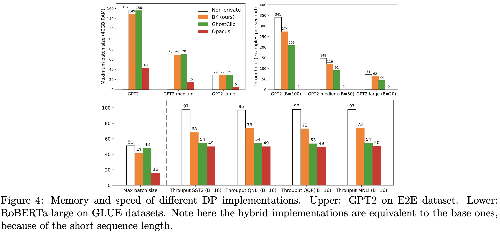
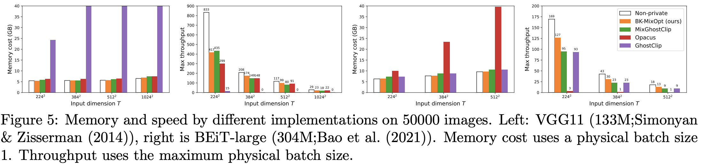

# Fast Differential Privacy

*Fast Differential Privacy* is a library that allows differentially private optimization of PyTorch models, with a few additional lines of code. It supports all PyTorch optimizers, popular models in [TIMM](https://github.com/rwightman/pytorch-image-models), [torchvision](https://github.com/pytorch/vision), [HuggingFace](https://huggingface.co/transformers/) (up to supported modules), multiple privacy accountants, and multiple clipping functions. The library has provably little overhead in terms of training time and memory cost, compared with the standard non-private optimization.


---
## Installation.
To install the library after Git clone, run
```bash
python -m setup develop --user
```

> :warning: **NOTE**: We strongly recommend Python>=3.8 and torch<=1.11 (it is a known issue that torch 1.12 can slow down as much as 3 times).

## Getting started
To train a model with differential privacy, simply create a `PrivacyEngine`, attach it to any optimizer (e.g. SGD, Adam), and continue the standard training pipeline:

```python
from fastDP import PrivacyEngine
optimizer = SGD(model.parameters(), lr=0.05)
privacy_engine = PrivacyEngine(
    model,
    batch_size=256,
    sample_size=50000,
    epochs=3,
    target_epsilon=2,
    clipping_fn='automatic',
    clipping_mode='MixOpt'
    origin_params=None,
    clipping_style='all-layer',
)
privacy_engine.attach(optimizer)

#----- standard training pipeline
loss = F.cross_entropy(model(batch), labels)
loss.backward()
optimizer.step()
optimizer.zero_grad()
```

We provide details about our privacy engine in `fastDP/README.md`, including the supported modules and the arguments. By default, we use the `'MixOpt'` (hybrid book-keeping [4]) clipping mode (which enjoys almost the same time complexity as non-private optimization), and the automatic clipping function [8] (which does not need to tune the clipping threshold `max_grad_norm`). We support RDP and GLW privacy accountant, and additional accountants can be used through the argument `noise_multiplier`, after its calculation from [[Automating differential privacy computation](https://github.com/yuxiangw/autodp)] library.

Specifically, we allow the gradient accumulation to use very large batch size, which is beneficial to DP optimization:
```python
for i, batch in enumerate(dataloader):
    loss = F.cross_entropy(model(batch), labels)
    loss.backward()
    if i % gradient_accumulation_steps == 0:
        optimizer.step()
        optimizer.zero_grad()
```

## Highlights
1. This library enables DP training to have almost **the same time and space complexity** as the standard non-private training. This is achieved by three key techniques as described in [4]: mixed ghost norm, book-keeping, and ghost differentiation. In practice, e.g. on GPT2, we observe <1% memory overhead and <10% slowdown.

<p align="center">
  
</p>

2. Specifically, the mixed ghost norm trick [3,8] overcomes the severe memory issues of large model (commonly encountered by Opacus, which computes the per-sample gradients) and high dimensional data (commonly encountered by ghost clipping, e.g. in Private transformers).

<p align="center">
  
</p>

3. We support all [`torch.optim`](https://pytorch.org/docs/stable/optim.html) (SGD, Adam, AdaGrad,...) and a wide range of models (BERT, RoBERTa, GPT, ViT, BEiT, CrossViT, DEiT, ResNet, VGG, DenseNet,...), including their parameter-efficient variants. For example, one can run DP bias-term fine-tuning (DP-BiTFiT) by simply freezing non-bias terms, as in `examples/image_classification`.

------
Full fine-tuning results on a single A100 GPU

| Datasets | ε | Setting                                                  | Model         | Accuracy  | Time(min)/epoch |
|----------|---|----------------------------------------------------------|---------------|-----------|-----------------|
| CIFAR10  | 2 | [6] | ViT-large     | 98.9      | 7.0             |
| CIFAR100 | 2 | [6] | BEiT-large    | 88.7      | 6.5             |
| CelebA   | 3 | [6] | ResNet18      | 88.2      | 2.7             |
| SST2     | 3 | [8] | RoBERTa-large | 93.9      | 13.5            |
| QNLI     | 3 | [8] | RoBERTa-large | 91.0      | 20.2            |
| QQP      | 3 | [8] | RoBERTa-large | 86.8      | 70.0            |
| MNLI     | 3 | [8] | RoBERTa-large | 86.3/86.7 | 77.1            |

More datasets, epsilon budgets, models, fine-tuning styles, and different hyperparamters can be found in the related papers.


## Examples
The `examples` folder covers tasks on the table-to-text (E2E and DART datasets with GPT2 models), the text classification (SST2/QNLI/QQP/MNLI datasets with BERT/RoBERTa models), and the image classification (CIFAR10/CIFAR100/CelebA datasets with [TIMM](https://github.com/rwightman/pytorch-image-models)/[torchvision](https://github.com/pytorch/vision) models). Detailed `README.md` can be found in each sub-folder. These examples can be used to reproduce the results in [2,3,4,6,8].


## Citation
Please consider citing the following if you want to use this library in your works:
```
@article{bu2022differentially,
  title={Differentially Private Optimization on Large Model at Small Cost},
  author={Bu, Zhiqi and Wang, Yu-Xiang and Zha, Sheng and Karypis, George},
  journal={arXiv preprint arXiv:2210.00038},
  year={2022}
}

@article{bu2022differentially,
  title={Differentially Private Bias-Term only Fine-tuning of Foundation Models},
  author={Bu, Zhiqi and Wang, Yu-Xiang and Zha, Sheng and Karypis, George},
  journal={arXiv preprint arXiv:2210.00036},
  year={2022}
}
```

## Acknowledgements
This codebase is largely inspired by [[Opacus (v0.15)]](https://github.com/pytorch/opacus), [[Private transformers (v0.2.3)]](https://github.com/lxuechen/private-transformers), [[Private Vision]](https://github.com/woodyx218/private_vision), and [[FastGradClip]](https://github.com/ppmlguy/fastgradclip).

## References
[1] Goodfellow, Ian. "Efficient per-example gradient computations." arXiv preprint arXiv:1510.01799 (2015).

[2] Li, Xuechen, Florian Tramer, Percy Liang, and Tatsunori Hashimoto. "Large language models can be strong differentially private learners." arXiv preprint arXiv:2110.05679 (2021).

[3] Bu, Zhiqi, Jialin Mao, and Shiyun Xu. "Scalable and Efficient Training of Large Convolutional Neural Networks with Differential Privacy." arXiv preprint arXiv:2205.10683 (2022).

[4] Bu, Zhiqi, Yu-Xiang Wang, Sheng Zha, and George Karypis. "Differentially Private Optimization on Large Model at Small Cost." arXiv preprint arXiv:2210.00038 (2022).

[5] Yousefpour, Ashkan, Igor Shilov, Alexandre Sablayrolles, Davide Testuggine, Karthik Prasad, Mani Malek, John Nguyen et al. "Opacus: User-friendly differential privacy library in PyTorch." arXiv preprint arXiv:2109.12298 (2021).

[6] Bu, Zhiqi, Yu-Xiang Wang, Sheng Zha, and George Karypis. "Differentially Private Bias-Term only Fine-tuning of Foundation Models." arXiv preprint arXiv:2210.00036 (2022).

[7] Abadi, Martin, et al. "Deep learning with differential privacy." Proceedings of the 2016 ACM SIGSAC Conference on Computer and Communications Security.

[8] Bu, Zhiqi, Yu-Xiang Wang, Sheng Zha, and George Karypis. "Automatic clipping: Differentially private deep learning made easier and stronger." arXiv preprint arXiv:2206.07136 (2022).
